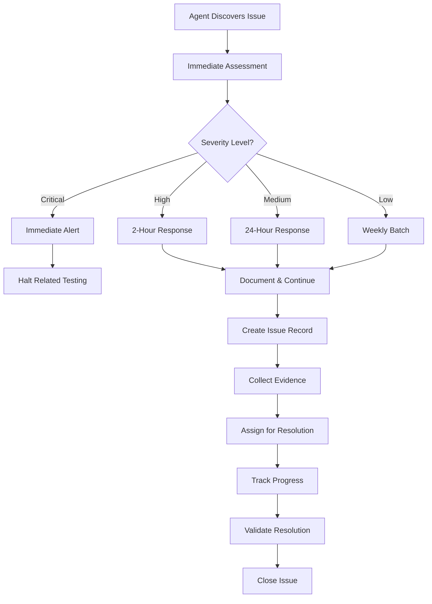
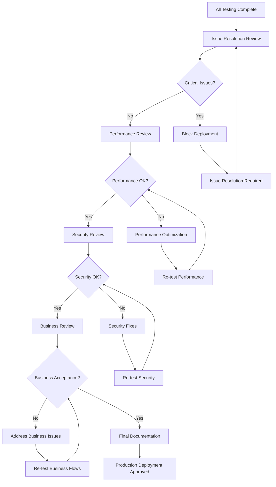

# FibreFlow React - Issue Tracking & Validation Workflow

## Executive Summary

This document defines the comprehensive issue tracking, resolution, and validation workflow for the FibreFlow React testing process. It establishes clear protocols for issue discovery, classification, resolution tracking, and production readiness validation.

**Objective**: Zero-defect production deployment through systematic issue management with automated tracking, evidence collection, and resolution validation.

---

## Issue Classification System

### Severity Classification

#### Critical Issues (Production Blockers)
```typescript
interface CriticalIssue {
  definition: "Prevents core functionality, blocks primary user workflows";
  examples: [
    "Authentication system failure",
    "Database connection loss", 
    "Data corruption or loss",
    "Security vulnerabilities",
    "Complete module failures"
  ];
  responseTime: "Immediate (0-30 minutes)";
  resolutionTime: "Same day (0-8 hours)";
  escalation: "Immediate stakeholder notification";
  testingImpact: "Halt dependent testing until resolved";
}
```

#### High Priority Issues (Significant Impact)
```typescript  
interface HighPriorityIssue {
  definition: "Significant feature impairment, poor user experience";
  examples: [
    "Form validation failures",
    "Data synchronization issues",
    "Performance degradation >2x baseline",
    "Missing required functionality",
    "Integration failures between modules"
  ];
  responseTime: "Within 2 hours";
  resolutionTime: "Within 24 hours";  
  escalation: "Daily stakeholder updates";
  testingImpact: "Continue with workarounds";
}
```

#### Medium Priority Issues (Moderate Impact)
```typescript
interface MediumPriorityIssue {
  definition: "Minor bugs, usability issues, non-critical failures";
  examples: [
    "UI/UX inconsistencies",
    "Minor validation errors", 
    "Cosmetic display issues",
    "Non-critical feature gaps",
    "Performance issues within acceptable range"
  ];
  responseTime: "Within 24 hours";
  resolutionTime: "Within 1 week";
  escalation: "Weekly status reports";
  testingImpact: "Document and continue";
}
```

#### Low Priority Issues (Minor Impact)
```typescript
interface LowPriorityIssue {
  definition: "Enhancement suggestions, edge cases, nice-to-have features";
  examples: [
    "UI polish suggestions",
    "Edge case handling",
    "Performance optimizations",
    "Accessibility improvements",
    "Future enhancement ideas"
  ];
  responseTime: "Within 1 week";
  resolutionTime: "Next release cycle";
  escalation: "Monthly reviews";
  testingImpact: "No impact on testing progress";
}
```

### Issue Categories

```typescript
enum IssueCategory {
  FUNCTIONALITY = 'functionality',     // Feature not working as expected
  PERFORMANCE = 'performance',         // Speed, responsiveness, resource usage
  UI_UX = 'ui_ux',                    // Design, usability, accessibility
  DATA_INTEGRITY = 'data_integrity',   // Database consistency, validation
  SECURITY = 'security',               // Vulnerabilities, access control
  INTEGRATION = 'integration',         // Module interaction, API issues
  MOBILE = 'mobile',                   // Mobile-specific problems
  BROWSER = 'browser',                 // Cross-browser compatibility
  NETWORK = 'network',                 // Connectivity, API communication
  DOCUMENTATION = 'documentation'       // Missing/incorrect documentation
}
```

---

## Issue Documentation Framework

### Standard Issue Template
```markdown
# Issue #{ISSUE_ID}: {TITLE}

## Classification
- **Severity**: Critical | High | Medium | Low  
- **Category**: {IssueCategory}
- **Module**: {Affected Module(s)}
- **Agent**: {Discovering Agent}
- **Discovery Date**: {YYYY-MM-DD HH:MM}
- **Environment**: Development | Staging | Production

## Description
### Summary
Brief, clear description of the issue

### Detailed Description  
Comprehensive explanation of the problem including context

## Reproduction
### Prerequisites
- User role: {role}
- Data state: {required data}
- Browser: {browser/version}
- Viewport: {desktop/mobile/tablet}

### Steps to Reproduce
1. Navigate to {page/url}
2. Perform {action}
3. Observe {result}
4. Expected: {expected behavior}
5. Actual: {actual behavior}

### Reproduction Rate
- Consistent (100%)
- Frequent (>75%)  
- Intermittent (25-75%)
- Rare (<25%)

## Evidence
### Screenshots
- 
-  
- 

### Error Logs
```
[Relevant console errors, network logs, or stack traces]
```

### Video Recording (if applicable)
- [Video demonstration of issue](path/to/video.mp4)

### Network Traces (if applicable)
- Request/Response details
- Performance timing data
- Failed API calls

## Impact Analysis
### User Impact
- **Affected Users**: {percentage or count}
- **Workflow Impact**: {description of disruption}
- **Workaround Available**: Yes/No - {description}

### Business Impact  
- **Revenue Impact**: {if applicable}
- **Reputation Risk**: Low/Medium/High
- **Compliance Risk**: {if applicable}

### Technical Impact
- **System Stability**: {impact on overall system}
- **Data Integrity**: {risk to data consistency}
- **Performance Impact**: {system-wide effects}

## Technical Analysis
### Root Cause Analysis
- **Immediate Cause**: {what directly caused the issue}
- **Contributing Factors**: {environmental or design factors}
- **Root Cause**: {fundamental underlying cause}

### Affected Components
- Frontend Components: {list}
- Backend Services: {list}  
- Database Tables: {list}
- Third-party Services: {list}

### Dependencies
- **Blocking Issues**: {issues that must be resolved first}
- **Related Issues**: {similar or connected problems}
- **Dependent Tests**: {tests blocked by this issue}

## Proposed Resolution
### Immediate Actions
1. {Short-term fix or workaround}
2. {Mitigation steps}

### Permanent Solution
1. {Long-term fix approach}
2. {Code changes required}
3. {Testing requirements}

### Alternative Approaches
- Option A: {description with pros/cons}
- Option B: {description with pros/cons}

## Validation Criteria
### Resolution Acceptance Criteria
- [ ] Original issue no longer reproducible
- [ ] No regression in related functionality  
- [ ] Performance impact within acceptable limits
- [ ] User acceptance criteria met
- [ ] Automated tests updated to prevent regression

### Testing Requirements
- [ ] Unit tests for affected components
- [ ] Integration tests for affected workflows
- [ ] Performance tests if applicable
- [ ] Cross-browser testing if applicable
- [ ] Mobile testing if applicable

## Stakeholder Information
- **Assigned Developer**: {name}
- **QA Reviewer**: {name}  
- **Business Stakeholder**: {name}
- **Expected Resolution Date**: {YYYY-MM-DD}
- **Actual Resolution Date**: {YYYY-MM-DD}

## Resolution Summary
### Final Solution
{Description of implemented solution}

### Code Changes
- Files Modified: {list}
- Database Changes: {if any}
- Configuration Changes: {if any}

### Validation Results
- [ ] Issue resolved and verified
- [ ] No new issues introduced
- [ ] Performance benchmarks met
- [ ] Stakeholder approval received

## Lessons Learned
### Prevention Measures
{How to prevent similar issues in the future}

### Process Improvements
{Suggested improvements to development/testing process}
```

---

## Issue Discovery & Documentation Process

### Automated Issue Detection
```typescript
interface AutomatedIssueDetection {
  performanceMonitoring: {
    pageLoadThreshold: 1500; // ms
    apiResponseThreshold: 200; // ms
    memoryUsageThreshold: 512; // MB
    errorRateThreshold: 0.1; // %
  };
  
  functionalTesting: {
    testFailures: 'immediate_flag';
    assertionFailures: 'immediate_flag';
    unexpectedBehavior: 'manual_review';
  };
  
  browserConsoleMonitoring: {
    errorLevel: 'immediate_flag';
    warningLevel: 'batch_review';
    networkFailures: 'immediate_flag';
  };
  
  userExperienceMetrics: {
    clickSuccess: 'track_failures';
    formCompletion: 'track_abandonment';
    navigationSuccess: 'track_errors';
  };
}
```

### Manual Issue Reporting Process


### Evidence Collection Standards

#### Screenshot Requirements
```typescript
interface ScreenshotStandards {
  resolution: {
    desktop: { width: 1920, height: 1080 };
    tablet: { width: 768, height: 1024 };
    mobile: { width: 375, height: 667 };
  };
  
  captureRequirements: {
    beforeState: 'required';
    errorState: 'required';
    expectedState: 'required_if_available';
    browserDevTools: 'required_for_technical_issues';
  };
  
  namingConvention: '{agentId}_{timestamp}_{issueId}_{state}.png';
  
  annotationRequirements: {
    highlightProblemArea: 'required';
    addDescriptiveText: 'recommended';
    includeTimestamp: 'required';
  };
}
```

#### Error Log Collection
```typescript
interface ErrorLogStandards {
  browserConsole: {
    errors: 'complete_stack_trace';
    warnings: 'context_relevant_only';
    networkErrors: 'full_request_response';
  };
  
  applicationLogs: {
    frontend: 'react_error_boundaries';
    backend: 'api_error_responses';  
    database: 'query_errors_and_constraints';
  };
  
  performanceLogs: {
    timings: 'navigation_timing_api';
    resources: 'resource_timing_api';
    memory: 'performance_memory_api';
  };
}
```

---

## Resolution Workflow Management

### Issue Assignment Process
```typescript
interface IssueAssignment {
  automaticAssignment: {
    critical: 'senior_developer_immediate';
    high: 'available_developer_2h';
    medium: 'team_assignment_24h';
    low: 'backlog_for_sprint_planning';
  };
  
  skillBasedRouting: {
    security: 'security_specialist';
    performance: 'performance_engineer';
    ui_ux: 'frontend_specialist';
    data_integrity: 'backend_specialist';
    integration: 'fullstack_developer';
  };
  
  workloadBalancing: {
    maxCriticalIssues: 2;
    maxHighIssues: 5;
    totalIssueLimit: 10;
  };
}
```

### Progress Tracking System
```typescript
enum IssueStatus {
  DISCOVERED = 'discovered',
  TRIAGED = 'triaged',
  ASSIGNED = 'assigned', 
  IN_PROGRESS = 'in_progress',
  PENDING_REVIEW = 'pending_review',
  TESTING = 'testing',
  RESOLVED = 'resolved',
  CLOSED = 'closed',
  REOPENED = 'reopened'
}

interface IssueProgressTracking {
  statusTransitions: {
    discovered: ['triaged', 'closed'];
    triaged: ['assigned', 'closed'];
    assigned: ['in_progress', 'reassigned'];
    in_progress: ['pending_review', 'blocked', 'resolved'];
    pending_review: ['in_progress', 'testing', 'rejected'];
    testing: ['resolved', 'in_progress', 'failed'];
    resolved: ['closed', 'reopened'];
    closed: ['reopened'];
    reopened: ['triaged'];
  };
  
  timeTracking: {
    discoveryTime: Date;
    triageTime: Date;
    assignmentTime: Date;
    startWorkTime: Date;
    resolutionTime: Date;
    closureTime: Date;
  };
  
  effortTracking: {
    investigationHours: number;
    developmentHours: number;
    testingHours: number;
    reviewHours: number;
  };
}
```

### Communication Protocols

#### Stakeholder Notification Matrix
```typescript
interface NotificationMatrix {
  critical: {
    immediate: ['project_manager', 'tech_lead', 'product_owner'];
    hourly_updates: ['development_team', 'qa_team'];
    resolution: ['all_stakeholders', 'customer_if_external'];
  };
  
  high: {
    within_2h: ['tech_lead', 'assigned_developer'];
    daily_updates: ['project_manager'];
    resolution: ['tech_lead', 'qa_lead'];
  };
  
  medium: {
    within_24h: ['assigned_developer'];
    weekly_updates: ['tech_lead'];
    resolution: ['assigned_developer', 'qa_reviewer'];
  };
  
  low: {
    assignment: ['assigned_developer'];
    resolution: ['assigned_developer'];
  };
}
```

#### Communication Templates
```markdown
### Critical Issue Alert Template
Subject: 🚨 CRITICAL: {Issue Title} - Immediate Attention Required

**Issue ID**: #{issue_id}
**Discovered**: {timestamp}
**Agent**: {discovering_agent}
**Impact**: {brief_impact_description}

**Immediate Actions Required**:
1. {action_item_1}
2. {action_item_2}

**Testing Status**: {halted/continuing_with_workaround}
**Next Update**: {time_commitment}

### Resolution Confirmation Template  
Subject: ✅ RESOLVED: {Issue Title}

**Issue ID**: #{issue_id}
**Resolution Time**: {total_hours}
**Solution**: {brief_solution_description}

**Validation Completed**:
- [ ] Original issue resolved
- [ ] No regressions introduced
- [ ] Performance benchmarks met
- [ ] Stakeholder approval received

**Testing Status**: {resuming/continuing}
```

---

## Validation & Quality Assurance

### Pre-Resolution Validation Checklist
```typescript
interface PreResolutionValidation {
  issueAnalysis: {
    rootCauseIdentified: boolean;
    impactFullyAssessed: boolean;
    evidenceComplete: boolean;
    reproducibilityConfirmed: boolean;
  };
  
  solutionDesign: {
    approachDocumented: boolean;
    alternativesConsidered: boolean;
    riskAssessmentComplete: boolean;
    stakeholderApprovalReceived: boolean;
  };
  
  implementationPlan: {
    changesIdentified: boolean;
    testingPlanDefined: boolean;
    rollbackPlanPrepared: boolean;
    timelineEstablished: boolean;
  };
}
```

### Post-Resolution Validation Process
```typescript
interface PostResolutionValidation {
  functionalValidation: {
    originalIssueResolved: boolean;
    userWorkflowsOperational: boolean;
    edgeCasesHandled: boolean;
    performanceAcceptable: boolean;
  };
  
  regressionTesting: {
    relatedFunctionalityTested: boolean;
    integrationsVerified: boolean;
    dataIntegrityConfirmed: boolean;
    performanceBaselineMaintained: boolean;
  };
  
  stakeholderAcceptance: {
    businessRequirementsMet: boolean;
    userExperienceAcceptable: boolean;
    performanceCriteriaMet: boolean;
    securityRequirementsStatisfied: boolean;
  };
}
```

### Regression Prevention Measures
```typescript
interface RegressionPrevention {
  automatedTestUpdates: {
    unitTestsAdded: boolean;
    integrationTestsUpdated: boolean;
    e2eTestsModified: boolean;
    performanceTestsAdjusted: boolean;
  };
  
  codeQualityMeasures: {
    codeReviewCompleted: boolean;
    staticAnalysisPassed: boolean;
    securityScanCompleted: boolean;
    performanceProfiled: boolean;
  };
  
  documentationUpdates: {
    techDocsUpdated: boolean;
    userDocsRevised: boolean;
    troubleshootingGuideUpdated: boolean;
    knowledgeBaseEnriched: boolean;
  };
}
```

---

## Production Readiness Assessment

### Quality Gates Framework

#### Phase Completion Gates
```typescript
interface PhaseQualityGates {
  foundation: {
    criticalIssues: 0;
    highIssues: 0;
    infrastructureStable: true;
    performanceBaselineEstablished: true;
  };
  
  coreModules: {
    criticalIssues: 0;
    highIssues: 2; // maximum
    dataIntegrityConfirmed: true;
    primaryWorkflowsValidated: true;
  };
  
  fieldOperations: {
    criticalIssues: 0;
    highIssues: 3; // maximum  
    mobileCompatibilityConfirmed: true;
    realTimeUpdatesWorking: true;
  };
  
  integration: {
    criticalIssues: 0;
    highIssues: 1; // maximum
    crossModuleWorkflowsValidated: true;
    dataConsistencyConfirmed: true;
  };
  
  finalValidation: {
    criticalIssues: 0;
    highIssues: 0;
    securityAssessmentPassed: true;
    performanceBenchmarksMet: true;
  };
}
```

#### Production Deployment Readiness
```typescript
interface ProductionReadinessChecklist {
  issueResolution: {
    criticalIssuesResolved: 100; // percentage
    highIssuesResolved: 95; // percentage  
    mediumIssuesDocumented: 100; // percentage
    lowIssuesTriaged: 100; // percentage
  };
  
  performanceValidation: {
    pageLoadTimes: '<1.5s consistently';
    apiResponseTimes: '<200ms consistently';  
    errorRate: '<0.1% over 24h period';
    memoryUsage: 'stable over extended periods';
  };
  
  securityValidation: {
    vulnerabilityScanPassed: true;
    penetrationTestPassed: true;
    dataEncryptionValidated: true;
    accessControlsTested: true;
  };
  
  businessValidation: {
    userAcceptanceTestsPassed: true;
    businessWorkflowsValidated: true;
    complianceRequirementsMet: true;
    stakeholderSignOffReceived: true;
  };
}
```

### Final Production Sign-off Process


---

## Metrics & Reporting

### Issue Tracking KPIs
```typescript
interface IssueTrackingMetrics {
  discoveryMetrics: {
    issuesPerAgent: number;
    issuesPerModule: number;
    issuesPerTestingHour: number;
    automatedVsManualDiscovery: number;
  };
  
  resolutionMetrics: {
    averageResolutionTime: {
      critical: number; // hours
      high: number; // hours
      medium: number; // days  
      low: number; // days
    };
    resolutionRate: {
      firstAttempt: number; // percentage
      withRework: number; // percentage
      escalated: number; // percentage
    };
  };
  
  qualityMetrics: {
    regressionRate: number; // percentage
    reopenRate: number; // percentage
    validationAccuracy: number; // percentage
    stakeholderSatisfaction: number; // 1-10 scale
  };
}
```

### Executive Dashboard
```typescript
interface ExecutiveDashboard {
  currentStatus: {
    totalIssuesOpen: number;
    criticalIssuesOpen: number;
    highIssuesOpen: number;
    overdueCritical: number;
    overdueHigh: number;
  };
  
  progressIndicators: {
    testingCompletion: number; // percentage
    issueResolutionRate: number; // percentage  
    productionReadiness: number; // percentage
    estimatedCompletionDate: Date;
  };
  
  riskIndicators: {
    criticalRiskIssues: number;
    performanceRisks: number;
    securityRisks: number;
    timelineRisk: 'low' | 'medium' | 'high';
  };
  
  trends: {
    issueDiscoveryTrend: 'increasing' | 'stable' | 'decreasing';
    resolutionEfficiency: 'improving' | 'stable' | 'declining';
    qualityTrend: 'improving' | 'stable' | 'declining';
  };
}
```

This comprehensive issue tracking and validation workflow ensures systematic management of all discovered issues with clear resolution paths and production readiness validation criteria.