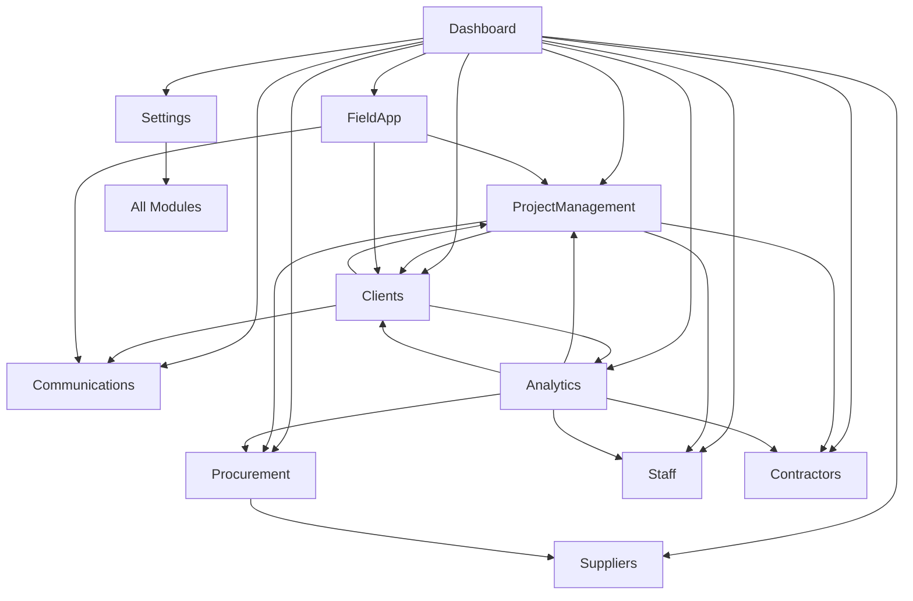

# FibreFlow React - Module Specifications V2

## Overview

This document provides detailed specifications for the reorganized business modules in the FibreFlow React migration. The architecture has been simplified into 10 logical portals/modules for better cohesion and maintainability.

---

## Module Architecture

```
src/modules/
├── dashboard/           # Main dashboard with cards to all modules
├── project-management/  # Projects, Pole Tracker, Fibre, Installs, SOW
├── clients/            # Client management and project associations
├── procurement/         # Stock, BOQ, RFQ, Orders
├── staff/              # Staff Management, RBAC
├── suppliers/          # Supplier CRUD and management
├── contractors/        # Contractor onboarding and compliance
├── communications/     # Meetings, Tasks, Todos
├── analytics/          # Reports, Analytics, AI insights, Daily Progress
├── field-app/          # Mobile field operations
└── settings/           # System configuration
```

---

## 1. Dashboard Module

### Purpose
Central hub providing quick access to all modules with summary statistics and notifications.

### Core Features
- Module navigation cards
- Key performance indicators
- Recent activity feed
- Notifications center
- Quick actions
- Role-based module visibility

### Components
```
modules/dashboard/
├── components/
│   ├── DashboardGrid/
│   ├── ModuleCard/
│   ├── StatsSummary/
│   ├── ActivityFeed/
│   └── QuickActions/
├── pages/
│   └── Dashboard/
└── hooks/
    └── useDashboardStats.ts
```

---

## 2. Project Management Module

### Purpose
Comprehensive project lifecycle management including pole tracking, fiber stringing, home installations, and scope of work.

### Core Features
- Project CRUD operations
- 4-level hierarchy: Project → Phase → Step → Task
- Pole Tracker (desktop and mobile views)
- Fiber stringing tracking
- Home installations management
- Drops completion tracking
- SOW (Scope of Work) management
- Progress visualization
- Team assignments
- Real-time status updates
- Client linkage

### Sub-modules
```
modules/project-management/
├── projects/
│   ├── components/
│   ├── services/
│   └── types/
├── pole-tracker/
│   ├── desktop/
│   ├── mobile/
│   └── services/
├── fiber-stringing/
│   ├── components/
│   └── services/
├── home-installs/
│   ├── components/
│   └── services/
├── drops/
│   ├── components/
│   └── services/
└── sow/
    ├── components/
    └── services/
```

### Data Models
```typescript
interface Project {
  id: string;
  title: string;
  clientId: string;  // Reference to clients collection
  status: 'active' | 'completed' | 'pending' | 'on-hold';
  priority: 'high' | 'medium' | 'low';
  location: string;
  startDate: Date;
  endDate?: Date;
  type: 'FTTH' | 'FTTB' | 'FTTC' | 'P2P';
  projectManager: UserReference;
  phases?: Phase[];
  poles?: PoleTracker[];
  installations?: Installation[];
  sow?: ScopeOfWork;
}

interface PoleTracker {
  id: string;
  poleNumber: string; // Globally unique
  projectId: string;
  location: GeoLocation;
  status: PoleStatus;
  photos: PolePhotos;
  drops: DropConnection[]; // Max 12
  contractor?: ContractorReference;
}

interface Installation {
  id: string;
  projectId: string;
  type: 'fiber_stringing' | 'home_install' | 'drop';
  address: string;
  status: InstallationStatus;
  completedDate?: Date;
  technician?: StaffReference;
}

interface ScopeOfWork {
  id: string;
  projectId: string;
  items: SOWItem[];
  totalValue: number;
  approvedBy?: UserReference;
  approvedDate?: Date;
}
```

---

## 3. Clients Portal Module

### Purpose
Comprehensive client relationship management with project associations, contracts, and communication history.

### Core Features
- Client CRUD operations
- Contact management (multiple contacts per client)
- Project associations and history
- Contract management
- Billing information
- Communication logs
- Document storage
- Client portal access management
- Service level agreements (SLAs)
- Client feedback and ratings

### Components
```
modules/clients/
├── management/
│   ├── components/
│   │   ├── ClientList/
│   │   ├── ClientDetail/
│   │   ├── ClientForm/
│   │   └── ClientCard/
│   ├── services/
│   └── types/
├── contacts/
│   ├── components/
│   └── services/
├── projects/
│   ├── active/
│   ├── history/
│   └── associations/
├── contracts/
│   ├── agreements/
│   ├── sla/
│   └── documents/
└── portal/
    ├── access/
    └── permissions/
```

### Data Models
```typescript
interface Client {
  id: string;
  companyName: string;
  registrationNo: string;
  taxNo: string;
  industry: string;
  size: 'small' | 'medium' | 'large' | 'enterprise';
  status: 'active' | 'inactive' | 'prospect';
  contacts: ClientContact[];
  address: Address;
  billing: BillingInfo;
  projects: string[];  // Array of project IDs
  contracts: Contract[];
  sla?: ServiceLevelAgreement;
  portalAccess: PortalAccess;
  rating?: number;
  notes?: string;
  createdDate: Date;
}

interface ClientContact {
  id: string;
  clientId: string;
  firstName: string;
  lastName: string;
  position: string;
  email: string;
  phone: string;
  mobile?: string;
  isPrimary: boolean;
  portalAccess: boolean;
}

interface Contract {
  id: string;
  clientId: string;
  contractNo: string;
  type: 'master' | 'project' | 'service';
  startDate: Date;
  endDate: Date;
  value: number;
  status: 'draft' | 'active' | 'expired' | 'terminated';
  documents: Document[];
}

interface ServiceLevelAgreement {
  id: string;
  clientId: string;
  responseTime: number; // hours
  resolutionTime: number; // hours
  availability: number; // percentage
  penalties: Penalty[];
}

interface PortalAccess {
  enabled: boolean;
  users: ClientPortalUser[];
  permissions: string[];
  lastAccess?: Date;
}
```

---

## 4. Procurement Portal Module

### Purpose
Complete procurement lifecycle management including inventory, bill of quantities, and request for quotes.

### Core Features
- Stock item management
- Stock movements tracking
- BOQ creation and management
- RFQ generation and tracking
- Purchase order management
- Supplier price comparisons
- Low stock alerts
- Material allocations to projects

### Sub-modules
```
modules/procurement/
├── stock/
│   ├── inventory/
│   ├── movements/
│   └── allocations/
├── boq/
│   ├── templates/
│   ├── calculations/
│   └── export/
├── rfq/
│   ├── creation/
│   ├── responses/
│   └── comparison/
└── orders/
    ├── purchase-orders/
    └── tracking/
```

### Data Models
```typescript
interface StockItem {
  id: string;
  code: string;
  name: string;
  category: MaterialCategory;
  unit: UnitOfMeasure;
  currentStock: number;
  minimumStock: number;
  maximumStock: number;
  supplierId?: string; // Reference to suppliers collection
  cost: number;
}

interface BOQ {
  id: string;
  projectId: string;
  clientId: string;  // Reference to client
  items: BOQItem[];
  totalCost: number;
  status: 'draft' | 'approved' | 'revised';
}

interface RFQ {
  id: string;
  boqId?: string;
  suppliers: string[]; // References to suppliers collection
  items: RFQItem[];
  deadline: Date;
  responses: RFQResponse[];
}
```

---

## 5. Staff Portal Module

### Purpose
Internal staff management with role-based access control and project assignments.

### Core Features
- Staff CRUD operations
- Role management (RBAC)
- Permission assignments
- Skills tracking
- Availability calendar
- Project allocations
- Performance metrics
- Leave management
- Training records

### Components
```
modules/staff/
├── management/
│   ├── components/
│   ├── services/
│   └── types/
├── rbac/
│   ├── roles/
│   ├── permissions/
│   └── assignments/
└── allocation/
    ├── projects/
    └── calendar/
```

### Data Models
```typescript
interface Staff {
  id: string;
  employeeId: string;
  firstName: string;
  lastName: string;
  email: string;
  role: Role;
  permissions: Permission[];
  department: string;
  skills: string[];
  projects: ProjectAssignment[];
  status: 'active' | 'inactive' | 'on-leave';
}

interface Role {
  id: string;
  name: string;
  permissions: Permission[];
  level: number;
}

interface Permission {
  id: string;
  resource: string;
  action: 'create' | 'read' | 'update' | 'delete';
}
```

---

## 6. Suppliers Portal Module

### Purpose
Comprehensive supplier relationship management with product catalogs and pricing.

### Core Features
- Supplier CRUD operations
- Product catalog management
- Price lists and updates
- Contact management
- Performance ratings
- Contract management
- Payment terms
- Document storage

### Components
```
modules/suppliers/
├── management/
│   ├── components/
│   └── services/
├── catalog/
│   ├── products/
│   └── pricing/
└── contracts/
    ├── terms/
    └── documents/
```

### Data Models
```typescript
interface Supplier {
  id: string;
  companyName: string;
  registrationNo: string;
  taxNo: string;
  contact: ContactInfo;
  products: Product[];
  priceList: PriceList;
  paymentTerms: PaymentTerms;
  rating: number;
  status: 'active' | 'inactive' | 'blacklisted';
}

interface Product {
  id: string;
  supplierId: string;
  name: string;
  code: string;
  category: string;
  unit: string;
  price: number;
  availability: 'in-stock' | 'out-of-stock' | 'discontinued';
}
```

---

## 7. Contractors Portal Module

### Purpose
External contractor management with comprehensive onboarding, compliance tracking, and performance monitoring.

### Core Features
- Contractor onboarding wizard
- Compliance document management
- Skills and capabilities tracking
- Project assignments
- Performance scoring (RAG)
- Payment processing
- Insurance verification
- Safety records
- Equipment tracking

### Components
```
modules/contractors/
├── onboarding/
│   ├── wizard/
│   ├── documents/
│   └── verification/
├── compliance/
│   ├── tracking/
│   ├── alerts/
│   └── reports/
├── assignments/
│   ├── projects/
│   └── scheduling/
└── performance/
    ├── scoring/
    └── reviews/
```

### Data Models
```typescript
interface Contractor {
  id: string;
  companyName: string;
  registrationNo: string;
  taxNo: string;
  contact: ContactInfo;
  services: string[];
  capabilities: Capabilities;
  compliance: ComplianceStatus;
  bankDetails: BankingInfo;
  projects: ContractorProject[];
  ragScore: RAGScore;
  status: 'active' | 'inactive' | 'blacklisted' | 'onboarding';
}

interface ComplianceStatus {
  insurance: Document;
  safety: Document;
  tax: Document;
  bbbee: Document;
  expiryDates: ExpiryTracking;
}

interface RAGScore {
  overall: 'red' | 'amber' | 'green';
  quality: number;
  timeline: number;
  safety: number;
  communication: number;
}
```

---

## 8. Communications Portal Module

### Purpose
Centralized communication hub for meetings, tasks, and team collaboration.

### Core Features
- Meeting management
- Fireflies.ai integration
- Action items tracking
- Task/Todo management
- Team notifications
- Document sharing
- Discussion threads
- Calendar integration

### Sub-modules
```
modules/communications/
├── meetings/
│   ├── calendar/
│   ├── notes/
│   └── action-items/
├── tasks/
│   ├── personal/
│   ├── team/
│   └── project/
└── notifications/
    ├── in-app/
    └── email/
```

### Data Models
```typescript
interface Meeting {
  id: string;
  title: string;
  date: Date;
  participants: Participant[];
  clientId?: string;  // Optional client association
  projectId?: string;  // Optional project association
  notes: string;
  actionItems: ActionItem[];
  recording?: string;
  transcript?: string;
  firefliesId?: string;
}

interface Task {
  id: string;
  title: string;
  description: string;
  assignee: UserReference;
  projectId?: string;
  clientId?: string;  // Tasks can be client-specific
  priority: Priority;
  status: TaskStatus;
  dueDate: Date;
  tags: string[];
}

interface ActionItem {
  id: string;
  meetingId?: string;
  description: string;
  assignee: UserReference;
  dueDate: Date;
  status: 'pending' | 'in-progress' | 'completed';
}
```

---

## 9. Analytics / Reporting / AI Module

### Purpose
Comprehensive analytics, reporting, and AI-powered insights including daily progress tracking.

### Core Features
- Executive dashboards
- Daily progress tracking (KPIs)
- Weekly/Monthly reports
- Custom report builder
- Data visualization
- Trend analysis
- AI predictions
- Export capabilities (PDF, Excel)
- Scheduled reports
- Performance metrics
- Client-specific reporting

### Sub-modules
```
modules/analytics/
├── dashboards/
│   ├── executive/
│   ├── operational/
│   ├── financial/
│   └── client/        # Client-specific dashboards
├── daily-progress/
│   ├── kpis/
│   ├── forms/
│   └── summary/
├── reports/
│   ├── builder/
│   ├── templates/
│   └── scheduled/
├── ai/
│   ├── predictions/
│   ├── insights/
│   └── recommendations/
└── exports/
    ├── pdf/
    └── excel/
```

### Data Models
```typescript
interface DailyProgress {
  id: string;
  date: Date;
  projectId: string;
  clientId: string;  // Track progress per client
  kpis: DailyKPIs;
  financial: FinancialMetrics;
  quality: QualityMetrics;
  submittedBy: UserReference;
}

interface Report {
  id: string;
  name: string;
  type: ReportType;
  clientId?: string;  // Client-specific reports
  schedule?: Schedule;
  recipients: string[];
  format: 'pdf' | 'excel' | 'csv';
  template: ReportTemplate;
}

interface AIInsight {
  id: string;
  type: 'prediction' | 'recommendation' | 'anomaly';
  confidence: number;
  description: string;
  data: any;
  actionable: boolean;
}
```

---

## 10. Field App Module

### Purpose
Mobile-optimized application for field workers with offline capabilities.

### Core Features
- Offline-first architecture
- GPS tracking
- Photo capture (6 required photos)
- Quick data entry
- Work assignments
- Navigation assistance
- Sync queue management
- Barcode/QR scanning
- Digital signatures
- Time tracking
- Client site access

### Components
```
modules/field-app/
├── offline/
│   ├── queue/
│   ├── sync/
│   └── storage/
├── capture/
│   ├── photos/
│   ├── gps/
│   └── forms/
├── assignments/
│   ├── daily/
│   └── routing/
└── tracking/
    ├── time/
    └── location/
```

### Data Models
```typescript
interface FieldAssignment {
  id: string;
  workerId: string;
  type: 'pole_install' | 'fiber_string' | 'home_connect' | 'maintenance';
  location: GeoLocation;
  clientId?: string;  // Client site work
  projectId: string;
  scheduledDate: Date;
  status: AssignmentStatus;
  offlineData?: OfflineData;
}

interface OfflineData {
  id: string;
  type: string;
  data: any;
  capturedAt: Date;
  syncStatus: 'pending' | 'syncing' | 'synced' | 'failed';
  retryCount: number;
}
```

---

## 11. Settings Module

### Purpose
System configuration and administration.

### Core Features
- Company settings
- User preferences
- System configuration
- Email templates
- Backup/Restore
- Audit logs
- Integration settings
- OneMap configuration

### Components
```
modules/settings/
├── company/
│   ├── profile/
│   └── branding/
├── preferences/
│   ├── user/
│   └── system/
├── templates/
│   ├── email/
│   └── documents/
└── system/
    ├── backup/
    ├── audit/
    └── integrations/
```

---

## Module Communication & Data Sharing

### Shared Collections (Single Source of Truth)
```typescript
// These collections are shared across modules
const sharedCollections = {
  projects: 'projects',          // Used by multiple modules
  clients: 'clients',            // Single collection
  contractors: 'contractors',    // Single collection
  suppliers: 'suppliers',        // Single collection
  staff: 'staff',               // Single collection
  stockItems: 'stock-items',    // Single collection
  users: 'users',               // System-wide
};
```

### Inter-Module Communication
```typescript
// Event bus for module communication
interface ModuleEvent {
  source: string;      // Source module
  target: string;      // Target module
  event: string;       // Event type
  data: any;          // Event data
}

// Example: Client created, notify project management
eventBus.emit({
  source: 'clients',
  target: 'project-management',
  event: 'client.created',
  data: { clientId, clientName }
});

// Example: Project created, notify client portal
eventBus.emit({
  source: 'project-management',
  target: 'clients',
  event: 'project.created',
  data: { projectId, clientId }
});
```

### Data Access Patterns
```typescript
// Services can be imported across modules
import { projectService } from '@/modules/project-management/services';
import { clientService } from '@/modules/clients/services';
import { contractorService } from '@/modules/contractors/services';

// Shared hooks for common data
export function useSharedClients() {
  return useQuery({
    queryKey: ['clients'],
    queryFn: clientService.getAll,
    staleTime: 5 * 60 * 1000,
  });
}
```

---

## Module Dependencies



---

## Implementation Priority

1. **Phase 1**: Dashboard + Settings (Foundation)
2. **Phase 2**: Staff Portal (Authentication & RBAC)
3. **Phase 3**: Clients Portal (Core relationships)
4. **Phase 4**: Project Management (Core business)
5. **Phase 5**: Contractors + Suppliers (Resources)
6. **Phase 6**: Procurement (Materials)
7. **Phase 7**: Field App (Mobile operations)
8. **Phase 8**: Communications (Collaboration)
9. **Phase 9**: Analytics (Insights)

---

## Success Metrics

### Module Independence
- Each module can be developed independently
- Modules share data but not implementation
- Failure in one module doesn't break others
- Clear API boundaries between modules

### Data Integrity
- Single source of truth for each entity
- No duplicate collections
- Consistent data models across modules
- Real-time synchronization
- Client relationships maintained across modules

### Performance
- Lazy loading of modules
- Code splitting at module level
- Cached data sharing
- Optimized bundle sizes per module

---

*Document Version: 2.1*  
*Last Updated: 2025-08-19*  
*Status: Active - Includes Clients Portal*