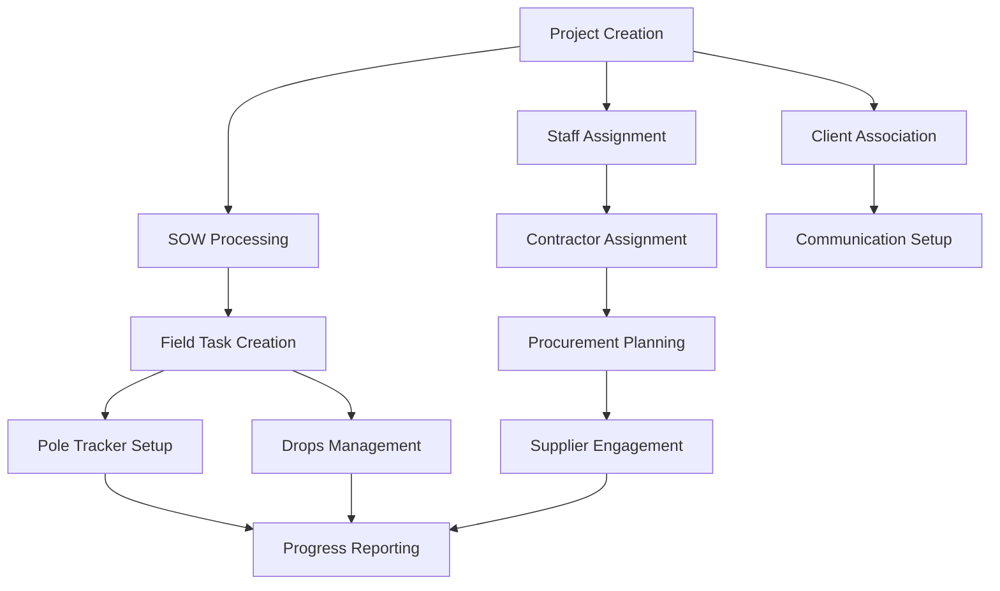

# FibreFlow React - Test Coverage Matrix & Dependencies

## Executive Summary

This matrix defines comprehensive test coverage requirements across all modules with precise dependency mapping, ensuring systematic validation of the entire FibreFlow React application ecosystem.

**Coverage Target**: 95%+ functional coverage across 12 major modules with complete integration testing between Firebase and Neon PostgreSQL systems.

---

## Module Coverage Requirements Matrix

### Core Infrastructure & Foundation

| Test Category | Infrastructure | Authentication | Navigation | Performance | Priority |
|--------------|---------------|---------------|------------|-------------|----------|
| **Functional Coverage** | 100% | 100% | 100% | 95% | CRITICAL |
| **Integration Coverage** | 100% | 100% | 95% | 90% | HIGH |
| **Security Coverage** | 100% | 100% | 85% | 80% | HIGH |
| **Performance Coverage** | 95% | 90% | 90% | 100% | HIGH |
| **Mobile Coverage** | N/A | 95% | 90% | 85% | MEDIUM |
| **Error Handling** | 100% | 100% | 95% | 90% | HIGH |
| **Data Validation** | 100% | 100% | 85% | 85% | MEDIUM |

#### Infrastructure Module Test Coverage
```typescript
interface InfrastructureTests {
  databaseConnections: {
    firebase: {
      connection: TestStatus.REQUIRED;
      authentication: TestStatus.REQUIRED;
      collections: TestStatus.REQUIRED;
      permissions: TestStatus.REQUIRED;
    };
    neonPostgreSQL: {
      connection: TestStatus.REQUIRED;
      ssl: TestStatus.REQUIRED;
      migrations: TestStatus.REQUIRED;
      performance: TestStatus.REQUIRED;
    };
  };
  environmentVariables: {
    required: TestStatus.REQUIRED;
    validation: TestStatus.REQUIRED;
    security: TestStatus.REQUIRED;
  };
  dependencies: {
    nodeModules: TestStatus.REQUIRED;
    versions: TestStatus.REQUIRED;
    conflicts: TestStatus.OPTIONAL;
  };
}
```

### Business Logic Modules

| Module | Functional | Integration | Performance | Security | Mobile | Data Integrity |
|--------|------------|-------------|-------------|----------|--------|----------------|
| **Dashboard** | 95% | 90% | 100% | 80% | 90% | 90% |
| **Projects** | 100% | 95% | 90% | 90% | 85% | 95% |
| **Staff** | 100% | 95% | 85% | 95% | 80% | 100% |
| **Clients** | 95% | 90% | 85% | 90% | 80% | 95% |
| **Contractors** | 100% | 95% | 85% | 95% | 85% | 95% |
| **Procurement** | 100% | 100% | 90% | 95% | 80% | 100% |

#### Dashboard Module Coverage Requirements
```typescript
interface DashboardTestCoverage {
  visualComponents: {
    statsCards: {
      dataAccuracy: TestStatus.REQUIRED;
      realTimeUpdates: TestStatus.REQUIRED;
      errorStates: TestStatus.REQUIRED;
      loadingStates: TestStatus.REQUIRED;
    };
    charts: {
      rendering: TestStatus.REQUIRED;
      dataBinding: TestStatus.REQUIRED;
      interactions: TestStatus.REQUIRED;
      responsiveness: TestStatus.REQUIRED;
      exportFunctionality: TestStatus.OPTIONAL;
    };
    activityFeed: {
      realTimeUpdates: TestStatus.REQUIRED;
      pagination: TestStatus.REQUIRED;
      filtering: TestStatus.REQUIRED;
      emptyStates: TestStatus.REQUIRED;
    };
  };
  dataIntegration: {
    firebaseQueries: TestStatus.REQUIRED;
    neonQueries: TestStatus.REQUIRED;
    aggregations: TestStatus.REQUIRED;
    caching: TestStatus.OPTIONAL;
  };
  performance: {
    initialLoad: TestStatus.REQUIRED; // <1.5s
    chartRendering: TestStatus.REQUIRED; // <500ms
    dataRefresh: TestStatus.REQUIRED; // <200ms
  };
}
```

### Field Operations Modules  

| Module | Functional | Integration | Performance | Security | Mobile | GPS/Location |
|--------|------------|-------------|-------------|----------|--------|-------------|
| **Field Operations** | 95% | 90% | 90% | 85% | 100% | 95% |
| **Pole Tracker** | 100% | 90% | 85% | 85% | 95% | 100% |
| **Drops Management** | 95% | 90% | 85% | 80% | 90% | 85% |
| **Fiber Stringing** | 95% | 85% | 85% | 80% | 90% | 90% |
| **Home Installations** | 95% | 85% | 85% | 80% | 95% | 85% |

#### Pole Tracker Comprehensive Coverage
```typescript
interface PoleTrackerTestMatrix {
  crudOperations: {
    create: {
      basicInfo: TestStatus.REQUIRED;
      gpsCoordinates: TestStatus.REQUIRED;
      photoUpload: TestStatus.REQUIRED;
      validation: TestStatus.REQUIRED;
    };
    read: {
      singlePole: TestStatus.REQUIRED;
      poleList: TestStatus.REQUIRED;
      filtering: TestStatus.REQUIRED;
      sorting: TestStatus.REQUIRED;
      pagination: TestStatus.REQUIRED;
    };
    update: {
      statusChanges: TestStatus.REQUIRED;
      photoUpdates: TestStatus.REQUIRED;
      qualityMetrics: TestStatus.REQUIRED;
      concurrentEditing: TestStatus.OPTIONAL;
    };
    delete: {
      softDelete: TestStatus.REQUIRED;
      cascadeEffects: TestStatus.REQUIRED;
      permissions: TestStatus.REQUIRED;
    };
  };
  mobileSpecific: {
    photoCapture: TestStatus.REQUIRED;
    gpsAccuracy: TestStatus.REQUIRED;
    offlineFunctionality: TestStatus.OPTIONAL;
    touchInteractions: TestStatus.REQUIRED;
  };
  integration: {
    projectLinking: TestStatus.REQUIRED;
    workflowProgression: TestStatus.REQUIRED;
    reportingSync: TestStatus.REQUIRED;
  };
}
```

### Document & Content Management

| Module | Functional | Integration | Performance | Security | File Processing | Version Control |
|--------|------------|-------------|-------------|----------|----------------|-----------------|
| **SOW Management** | 95% | 90% | 85% | 90% | 100% | 85% |
| **Procurement Docs** | 90% | 85% | 85% | 90% | 95% | 80% |
| **Contractor Docs** | 95% | 90% | 80% | 95% | 100% | 85% |

#### SOW Management Coverage Requirements
```typescript
interface SOWTestMatrix {
  fileOperations: {
    upload: {
      supportedFormats: TestStatus.REQUIRED; // PDF, DOC, DOCX
      fileSizeValidation: TestStatus.REQUIRED; // Max 50MB
      malwareScanning: TestStatus.OPTIONAL;
      progressIndicators: TestStatus.REQUIRED;
    };
    processing: {
      textExtraction: TestStatus.REQUIRED;
      dataValidation: TestStatus.REQUIRED;
      parsingAccuracy: TestStatus.REQUIRED; // >95%
      errorHandling: TestStatus.REQUIRED;
    };
    storage: {
      firebaseStorage: TestStatus.REQUIRED;
      metadataManagement: TestStatus.REQUIRED;
      accessControl: TestStatus.REQUIRED;
    };
  };
  dataIntegration: {
    projectLinking: TestStatus.REQUIRED;
    dataExtraction: TestStatus.REQUIRED;
    workflowTriggering: TestStatus.REQUIRED;
    auditTrails: TestStatus.REQUIRED;
  };
}
```

---

## Database Coverage Matrix

### Firebase Collections Coverage

| Collection | CRUD | Queries | Real-time | Security Rules | Performance | Data Validation |
|------------|------|---------|-----------|---------------|-------------|-----------------|
| **users** | 100% | 95% | 90% | 100% | 90% | 100% |
| **projects** | 100% | 100% | 95% | 95% | 95% | 100% |
| **clients** | 100% | 90% | 85% | 95% | 85% | 95% |
| **contractors** | 100% | 95% | 90% | 100% | 90% | 100% |
| **procurement** | 100% | 100% | 95% | 95% | 90% | 100% |
| **field_tasks** | 95% | 90% | 100% | 90% | 85% | 95% |
| **documents** | 90% | 85% | 80% | 100% | 80% | 90% |
| **audit_logs** | 85% | 90% | 85% | 100% | 85% | 95% |

#### Firebase Security Rules Testing
```typescript
interface FirebaseSecurityTests {
  authentication: {
    anonymousAccess: TestStatus.BLOCKED;
    userAuthentication: TestStatus.REQUIRED;
    tokenValidation: TestStatus.REQUIRED;
    sessionExpiry: TestStatus.REQUIRED;
  };
  authorization: {
    roleBasedAccess: TestStatus.REQUIRED;
    documentOwnership: TestStatus.REQUIRED;
    fieldLevelSecurity: TestStatus.REQUIRED;
    crossCollectionRules: TestStatus.REQUIRED;
  };
  dataValidation: {
    schemaEnforcement: TestStatus.REQUIRED;
    requiredFields: TestStatus.REQUIRED;
    dataTypes: TestStatus.REQUIRED;
    businessRules: TestStatus.REQUIRED;
  };
}
```

### Neon PostgreSQL Tables Coverage

| Table | CRUD | Joins | Indexes | Transactions | Performance | Integrity |
|-------|------|-------|---------|-------------|-------------|-----------|
| **staff** | 100% | 95% | 90% | 95% | 90% | 100% |
| **departments** | 95% | 90% | 85% | 90% | 85% | 100% |
| **positions** | 95% | 85% | 85% | 85% | 80% | 95% |
| **skills** | 90% | 90% | 85% | 85% | 80% | 90% |
| **staff_skills** | 95% | 100% | 90% | 90% | 85% | 100% |
| **hierarchies** | 90% | 95% | 85% | 90% | 80% | 100% |

#### Neon PostgreSQL Advanced Coverage
```typescript
interface NeonTestMatrix {
  complexQueries: {
    hierarchicalQueries: TestStatus.REQUIRED;
    aggregations: TestStatus.REQUIRED;
    windowFunctions: TestStatus.OPTIONAL;
    cteQueries: TestStatus.OPTIONAL;
  };
  performance: {
    indexUsage: TestStatus.REQUIRED;
    queryOptimization: TestStatus.REQUIRED;
    connectionPooling: TestStatus.REQUIRED;
    slowQueryLogging: TestStatus.OPTIONAL;
  };
  transactions: {
    acidCompliance: TestStatus.REQUIRED;
    deadlockHandling: TestStatus.REQUIRED;
    rollbackScenarios: TestStatus.REQUIRED;
    concurrentAccess: TestStatus.OPTIONAL;
  };
  dataIntegrity: {
    foreignKeyConstraints: TestStatus.REQUIRED;
    checkConstraints: TestStatus.REQUIRED;
    uniqueConstraints: TestStatus.REQUIRED;
    cascadingOperations: TestStatus.REQUIRED;
  };
}
```

---

## Integration Testing Dependencies

### Cross-Module Data Flow Requirements

#### Project → All Module Integration


#### Data Dependency Matrix
| Source Module | Target Module | Dependency Type | Test Priority | Validation Required |
|---------------|---------------|-----------------|---------------|-------------------|
| Projects | Staff | Assignment | HIGH | Role validation |
| Projects | SOW | Document Link | HIGH | File integrity |
| Projects | Field Operations | Task Creation | HIGH | Status sync |
| Staff | Contractors | Team Assignment | MEDIUM | Skill matching |
| Contractors | Procurement | Supplier Status | MEDIUM | Compliance check |
| Procurement | Field Operations | Resource Allocation | HIGH | Availability check |
| Field Operations | Pole Tracker | Asset Management | HIGH | Location accuracy |
| Pole Tracker | Reports | Progress Data | MEDIUM | Aggregation accuracy |

### API Integration Coverage

#### Internal API Coverage
```typescript
interface APITestMatrix {
  authenticationAPIs: {
    login: TestCoverage.REQUIRED;
    logout: TestCoverage.REQUIRED;
    tokenRefresh: TestCoverage.REQUIRED;
    passwordReset: TestCoverage.REQUIRED;
    permissions: TestCoverage.REQUIRED;
  };
  dataAPIs: {
    projects: {
      crud: TestCoverage.REQUIRED;
      search: TestCoverage.REQUIRED;
      filtering: TestCoverage.REQUIRED;
      pagination: TestCoverage.REQUIRED;
      bulkOperations: TestCoverage.OPTIONAL;
    };
    staff: {
      crud: TestCoverage.REQUIRED;
      import: TestCoverage.REQUIRED;
      export: TestCoverage.REQUIRED;
      analytics: TestCoverage.REQUIRED;
    };
    procurement: {
      boqManagement: TestCoverage.REQUIRED;
      rfqProcessing: TestCoverage.REQUIRED;
      supplierIntegration: TestCoverage.REQUIRED;
      stockManagement: TestCoverage.REQUIRED;
    };
  };
  fileAPIs: {
    upload: TestCoverage.REQUIRED;
    download: TestCoverage.REQUIRED;
    processing: TestCoverage.REQUIRED;
    security: TestCoverage.REQUIRED;
  };
}
```

#### External Service Integration
```typescript
interface ExternalServiceTests {
  firebaseServices: {
    authentication: TestCoverage.REQUIRED;
    firestore: TestCoverage.REQUIRED;
    storage: TestCoverage.REQUIRED;
    functions: TestCoverage.OPTIONAL;
  };
  neonDatabase: {
    connection: TestCoverage.REQUIRED;
    queries: TestCoverage.REQUIRED;
    transactions: TestCoverage.REQUIRED;
    performance: TestCoverage.REQUIRED;
  };
  emailServices: {
    notifications: TestCoverage.OPTIONAL;
    invitations: TestCoverage.OPTIONAL;
    reports: TestCoverage.OPTIONAL;
  };
}
```

---

## User Workflow Coverage Matrix

### Primary User Journeys

#### 1. Complete Project Lifecycle (100% Coverage Required)
```typescript
interface ProjectLifecycleTests {
  phase1_Initiation: {
    projectCreation: TestStatus.REQUIRED;
    clientAssignment: TestStatus.REQUIRED;
    sowUpload: TestStatus.REQUIRED;
    teamSetup: TestStatus.REQUIRED;
  };
  phase2_Planning: {
    contractorOnboarding: TestStatus.REQUIRED;
    procurementPlanning: TestStatus.REQUIRED;
    fieldTaskCreation: TestStatus.REQUIRED;
    resourceAllocation: TestStatus.REQUIRED;
  };
  phase3_Execution: {
    taskAssignment: TestStatus.REQUIRED;
    progressTracking: TestStatus.REQUIRED;
    qualityAssurance: TestStatus.REQUIRED;
    communicationFlow: TestStatus.REQUIRED;
  };
  phase4_Completion: {
    deliveryValidation: TestStatus.REQUIRED;
    documentationFinalization: TestStatus.REQUIRED;
    customerHandover: TestStatus.REQUIRED;
    projectClosure: TestStatus.REQUIRED;
  };
}
```

#### 2. Staff Management Workflow (95% Coverage Required)
```typescript
interface StaffManagementFlow {
  onboarding: {
    staffCreation: TestStatus.REQUIRED;
    roleAssignment: TestStatus.REQUIRED;
    skillsManagement: TestStatus.REQUIRED;
    hierarchySetup: TestStatus.REQUIRED;
  };
  operations: {
    projectAssignment: TestStatus.REQUIRED;
    performanceTracking: TestStatus.REQUIRED;
    skillDevelopment: TestStatus.OPTIONAL;
    teamManagement: TestStatus.REQUIRED;
  };
  reporting: {
    performanceReports: TestStatus.REQUIRED;
    utilizationAnalysis: TestStatus.REQUIRED;
    skillGapAnalysis: TestStatus.OPTIONAL;
  };
}
```

#### 3. Procurement Workflow (100% Coverage Required)
```typescript
interface ProcurementWorkflow {
  planning: {
    boqCreation: TestStatus.REQUIRED;
    requirementsDefinition: TestStatus.REQUIRED;
    budgetApproval: TestStatus.REQUIRED;
  };
  sourcing: {
    supplierIdentification: TestStatus.REQUIRED;
    rfqCreation: TestStatus.REQUIRED;
    quoteCollection: TestStatus.REQUIRED;
    evaluation: TestStatus.REQUIRED;
  };
  purchasing: {
    poCreation: TestStatus.REQUIRED;
    supplierCommunication: TestStatus.REQUIRED;
    deliveryTracking: TestStatus.REQUIRED;
    invoiceProcessing: TestStatus.OPTIONAL;
  };
  inventory: {
    stockReceiving: TestStatus.REQUIRED;
    qualityInspection: TestStatus.REQUIRED;
    warehouseManagement: TestStatus.REQUIRED;
    issueTracking: TestStatus.REQUIRED;
  };
}
```

### Secondary User Journeys (85% Coverage Required)

#### Field Operations Mobile Workflow
```typescript
interface MobileFieldWorkflow {
  taskReceiving: {
    taskNotification: TestStatus.REQUIRED;
    taskDetails: TestStatus.REQUIRED;
    resourceVerification: TestStatus.REQUIRED;
  };
  execution: {
    locationCapture: TestStatus.REQUIRED;
    photoDocumentation: TestStatus.REQUIRED;
    progressUpdates: TestStatus.REQUIRED;
    qualityChecks: TestStatus.REQUIRED;
  };
  completion: {
    taskSignoff: TestStatus.REQUIRED;
    reportSubmission: TestStatus.REQUIRED;
    nextTaskRetrieval: TestStatus.OPTIONAL;
  };
}
```

---

## Testing Dependency Chain

### Sequential Dependencies (Must Complete in Order)

#### Foundation Chain
```
Infrastructure → Authentication → Navigation → Performance Baseline
```

#### Core Data Chain  
```
Projects Creation → Staff Assignment → Client Association → Team Setup
```

#### Operations Chain
```
Contractor Onboarding → Procurement Setup → Field Task Creation → Asset Management
```

#### Validation Chain
```
Data Integrity → Integration Testing → Security Validation → Performance Testing
```

### Parallel Execution Groups

#### Group A: Read-Only Operations (Can run simultaneously)
- Dashboard validation
- Reports generation  
- Analytics computation
- Performance monitoring

#### Group B: Independent Data Domains (Can run simultaneously)
- Staff management (Neon)
- Client management (Firebase)
- Document processing (Storage)

#### Group C: Field Operations (Can run after core setup)
- Pole tracker testing
- Drops management testing
- Fiber stringing testing
- Home installation testing

### Blocking Dependencies

#### Critical Blockers (Halt all testing)
- Database connection failures
- Authentication system failures
- Core routing failures

#### Module Blockers (Halt dependent modules only)
- Project creation failure → Blocks all project-dependent tests
- Staff system failure → Blocks team assignment tests
- File upload failure → Blocks document-dependent workflows

#### Non-Critical Blockers (Continue with warnings)
- Report generation failures
- Notification system failures
- Analytics computation failures

---

## Coverage Validation Criteria

### Quantitative Metrics
- **Functional Coverage**: 95%+ of identified test scenarios executed
- **Code Coverage**: 90%+ lines of code exercised during testing
- **API Coverage**: 100% of endpoints tested with success/failure scenarios
- **UI Coverage**: 95%+ of interactive elements validated
- **Data Coverage**: 100% of database operations tested with edge cases

### Qualitative Assessments
- **User Experience**: Intuitive workflows with minimal friction
- **Error Handling**: Clear, actionable error messages for all failure scenarios
- **Performance**: Consistent response times under normal and stress conditions
- **Security**: No critical vulnerabilities, proper access controls
- **Reliability**: Stable operation over extended test periods

### Acceptance Gates
```typescript
interface AcceptanceCriteria {
  criticalTests: {
    passRate: 100; // No critical test failures allowed
    blockers: 0;   // Zero critical blockers
  };
  highPriorityTests: {
    passRate: 98;  // Maximum 2% failure rate
    blockers: 2;   // Maximum 2 high-priority blockers
  };
  mediumPriorityTests: {
    passRate: 95;  // Maximum 5% failure rate
    blockers: 5;   // Maximum 5 medium-priority blockers
  };
  performance: {
    pageLoadTime: '<1.5s';
    apiResponseTime: '<200ms';
    errorRate: '<0.1%';
  };
}
```

This comprehensive test coverage matrix ensures systematic validation of every aspect of the FibreFlow React application with clear dependencies and measurable success criteria.