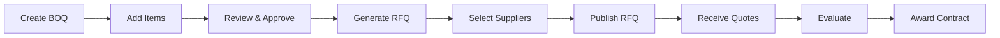

# Section 3.3: Procurement Module

## Overview

The Procurement module is a **comprehensive procurement management system** that digitizes the entire procurement lifecycle from Bill of Quantities (BOQ) through Request for Quote (RFQ) to stock management. This module replaces manual Excel-based processes with a fully integrated digital workflow.

### Module Scope
- **BOQ Management**: Bill of Quantities creation and tracking
- **RFQ Lifecycle**: Request for Quote creation, distribution, evaluation
- **Supplier Management**: Supplier invitations and quote submissions
- **Stock Control**: Inventory tracking and movement history
- **Cable Drum Management**: Specialized tracking for fiber cable drums

### Key Features
- Multi-step procurement workflows
- Supplier portal integration
- Automated quote comparison
- Real-time stock levels
- Audit trail for all transactions

## Database Schema

### Procurement Tables (14 tables)

#### BOQ Tables (`src/lib/neon/schema/procurement/boq.schema.ts`)

```typescript
// Bill of Quantities main table
export const boqs = pgTable('boqs', {
  id: uuid('id').primaryKey().defaultRandom(),
  boqNumber: varchar('boq_number', { length: 50 }).unique(),
  projectId: uuid('project_id').references(() => projects.id),
  title: varchar('title', { length: 255 }),
  status: varchar('status', { length: 50 }), // draft, approved, in_rfq, completed
  totalValue: decimal('total_value'),
  createdBy: uuid('created_by'),
  approvedBy: uuid('approved_by'),
  approvalDate: timestamp('approval_date'),
  createdAt: timestamp('created_at').defaultNow(),
});

// BOQ line items
export const boqItems = pgTable('boq_items', {
  id: uuid('id').primaryKey().defaultRandom(),
  boqId: uuid('boq_id').references(() => boqs.id),
  itemCode: varchar('item_code', { length: 50 }),
  description: text('description'),
  unit: varchar('unit', { length: 20 }),
  quantity: decimal('quantity'),
  unitPrice: decimal('unit_price'),
  totalPrice: decimal('total_price'),
  category: varchar('category', { length: 100 }),
});
```

#### RFQ Tables (`src/lib/neon/schema/procurement/rfq/`)

```typescript
// Request for Quote main table
export const rfqs = pgTable('rfqs', {
  id: uuid('id').primaryKey().defaultRandom(),
  rfqNumber: varchar('rfq_number', { length: 50 }).unique(),
  boqId: uuid('boq_id').references(() => boqs.id),
  title: varchar('title', { length: 255 }),
  status: varchar('status'), // draft, published, closed, awarded
  publishDate: timestamp('publish_date'),
  closingDate: timestamp('closing_date'),
  evaluationCriteria: json('evaluation_criteria'),
});

// Supplier invitations
export const supplierInvitations = pgTable('supplier_invitations', {
  id: uuid('id').primaryKey().defaultRandom(),
  rfqId: uuid('rfq_id').references(() => rfqs.id),
  supplierId: uuid('supplier_id'),
  invitationDate: timestamp('invitation_date'),
  status: varchar('status'), // invited, viewed, submitted, declined
  viewedAt: timestamp('viewed_at'),
});

// Quote submissions
export const quotes = pgTable('quotes', {
  id: uuid('id').primaryKey().defaultRandom(),
  rfqId: uuid('rfq_id').references(() => rfqs.id),
  supplierId: uuid('supplier_id'),
  quoteNumber: varchar('quote_number').unique(),
  totalAmount: decimal('total_amount'),
  validUntil: timestamp('valid_until'),
  status: varchar('status'), // draft, submitted, under_review, accepted, rejected
  submittedAt: timestamp('submitted_at'),
});
```

#### Stock Management Tables

```typescript
// Current stock positions
export const stockPositions = pgTable('stock_positions', {
  id: uuid('id').primaryKey().defaultRandom(),
  materialCode: varchar('material_code'),
  warehouseId: uuid('warehouse_id'),
  quantity: decimal('quantity'),
  unitOfMeasure: varchar('unit_of_measure'),
  lastUpdated: timestamp('last_updated'),
  minimumLevel: decimal('minimum_level'),
  maximumLevel: decimal('maximum_level'),
});

// Stock movements tracking
export const stockMovements = pgTable('stock_movements', {
  id: uuid('id').primaryKey().defaultRandom(),
  movementType: varchar('movement_type'), // receipt, issue, transfer, adjustment
  referenceNumber: varchar('reference_number'),
  fromLocation: uuid('from_location'),
  toLocation: uuid('to_location'),
  projectId: uuid('project_id'),
  movementDate: timestamp('movement_date'),
  createdBy: uuid('created_by'),
});

// Cable drum tracking
export const cableDrums = pgTable('cable_drums', {
  id: uuid('id').primaryKey().defaultRandom(),
  drumNumber: varchar('drum_number').unique(),
  cableType: varchar('cable_type'),
  originalLength: decimal('original_length'),
  currentLength: decimal('current_length'),
  location: varchar('location'),
  status: varchar('status'), // available, in_use, empty
});
```

## API Endpoints

### BOQ APIs (`api/procurement/boq/`)

```javascript
// GET /api/procurement/boq - List all BOQs
export async function getBOQs(projectId) {
  return await sql`
    SELECT b.*, p.project_name,
           COUNT(bi.id) as item_count,
           SUM(bi.total_price) as total_value
    FROM boqs b
    LEFT JOIN projects p ON b.project_id = p.id
    LEFT JOIN boq_items bi ON bi.boq_id = b.id
    WHERE ${projectId ? sql`b.project_id = ${projectId}` : sql`1=1`}
    GROUP BY b.id, p.project_name
    ORDER BY b.created_at DESC
  `;
}

// POST /api/procurement/boq - Create BOQ with items
export async function createBOQ(data) {
  return await sql.transaction(async (tx) => {
    // Create BOQ
    const [boq] = await tx`
      INSERT INTO boqs (boq_number, project_id, title, status)
      VALUES (${data.boqNumber}, ${data.projectId}, ${data.title}, 'draft')
      RETURNING *
    `;
    
    // Add BOQ items
    for (const item of data.items) {
      await tx`
        INSERT INTO boq_items (
          boq_id, item_code, description, 
          quantity, unit_price, total_price
        ) VALUES (
          ${boq.id}, ${item.itemCode}, ${item.description},
          ${item.quantity}, ${item.unitPrice}, 
          ${item.quantity * item.unitPrice}
        )
      `;
    }
    
    return boq;
  });
}
```

### RFQ APIs (`api/procurement/rfq/`)

```javascript
// POST /api/procurement/rfq - Create and publish RFQ
export async function createRFQ(data) {
  return await sql.transaction(async (tx) => {
    // Create RFQ from BOQ
    const [rfq] = await tx`
      INSERT INTO rfqs (
        rfq_number, boq_id, title, 
        status, closing_date
      ) VALUES (
        ${data.rfqNumber}, ${data.boqId}, ${data.title},
        'draft', ${data.closingDate}
      )
      RETURNING *
    `;
    
    // Copy BOQ items to RFQ items
    await tx`
      INSERT INTO rfq_items (rfq_id, item_code, description, quantity, unit)
      SELECT ${rfq.id}, item_code, description, quantity, unit
      FROM boq_items WHERE boq_id = ${data.boqId}
    `;
    
    // Invite suppliers
    for (const supplierId of data.supplierIds) {
      await tx`
        INSERT INTO supplier_invitations (rfq_id, supplier_id, status)
        VALUES (${rfq.id}, ${supplierId}, 'invited')
      `;
    }
    
    return rfq;
  });
}

// GET /api/procurement/rfq/:id/quotes - Get quotes for RFQ
export async function getRFQQuotes(rfqId) {
  return await sql`
    SELECT q.*, s.company_name as supplier_name,
           COUNT(qi.id) as items_count
    FROM quotes q
    LEFT JOIN suppliers s ON q.supplier_id = s.id
    LEFT JOIN quote_items qi ON qi.quote_id = q.id
    WHERE q.rfq_id = ${rfqId}
    GROUP BY q.id, s.company_name
    ORDER BY q.total_amount ASC
  `;
}
```

### Stock APIs (`api/procurement/stock.js`)

```javascript
// GET /api/procurement/stock - Current stock levels
export async function getStockLevels() {
  return await sql`
    SELECT sp.*, 
           CASE 
             WHEN sp.quantity <= sp.minimum_level THEN 'critical'
             WHEN sp.quantity <= sp.minimum_level * 1.2 THEN 'low'
             ELSE 'normal'
           END as stock_status
    FROM stock_positions sp
    WHERE sp.quantity > 0
    ORDER BY sp.material_code
  `;
}

// POST /api/procurement/stock/movement - Record stock movement
export async function recordStockMovement(data) {
  return await sql.transaction(async (tx) => {
    // Record movement
    const [movement] = await tx`
      INSERT INTO stock_movements (
        movement_type, reference_number,
        from_location, to_location, movement_date
      ) VALUES (
        ${data.type}, ${data.reference},
        ${data.from}, ${data.to}, NOW()
      )
      RETURNING *
    `;
    
    // Update stock positions
    if (data.type === 'issue') {
      await tx`
        UPDATE stock_positions 
        SET quantity = quantity - ${data.quantity}
        WHERE material_code = ${data.materialCode}
        AND warehouse_id = ${data.from}
      `;
    } else if (data.type === 'receipt') {
      await tx`
        UPDATE stock_positions 
        SET quantity = quantity + ${data.quantity}
        WHERE material_code = ${data.materialCode}
        AND warehouse_id = ${data.to}
      `;
    }
    
    return movement;
  });
}
```

## React Components

### Procurement Portal (`src/pages/procurement/`)

#### Main Navigation
```typescript
function ProcurementPage() {
  return (
    <div className="procurement-portal">
      <Tabs defaultValue="boq">
        <TabsList>
          <TabsTrigger value="boq">BOQ Management</TabsTrigger>
          <TabsTrigger value="rfq">RFQ Management</TabsTrigger>
          <TabsTrigger value="quotes">Quote Evaluation</TabsTrigger>
          <TabsTrigger value="stock">Stock Control</TabsTrigger>
        </TabsList>
        
        <TabsContent value="boq">
          <BOQManagement />
        </TabsContent>
        <TabsContent value="rfq">
          <RFQManagement />
        </TabsContent>
        <TabsContent value="quotes">
          <QuoteEvaluation />
        </TabsContent>
        <TabsContent value="stock">
          <StockControl />
        </TabsContent>
      </Tabs>
    </div>
  );
}
```

#### BOQ Components
- `BOQList` - Display all BOQs with real data
- `BOQCreate` - Multi-step BOQ creation wizard
- `BOQItemsTable` - Editable table for BOQ items
- `BOQApproval` - Approval workflow interface

#### RFQ Components
- `RFQCreate` - Create RFQ from approved BOQ
- `RFQList` - Active and closed RFQs
- `SupplierInvitation` - Manage supplier invitations
- `RFQTimeline` - Visual RFQ lifecycle

#### Quote Components
- `QuoteSubmission` - Supplier quote entry
- `QuoteComparison` - Side-by-side quote comparison
- `QuoteEvaluation` - Scoring and evaluation matrix
- `AwardRecommendation` - Award decision support

## Procurement Workflows

### BOQ to RFQ Workflow



### Stock Management Workflow

```typescript
// Material requisition to issue
async function processMaterialRequisition(requisition) {
  // Check stock availability
  const stock = await checkStock(requisition.items);
  
  if (stock.available) {
    // Create pick list
    const pickList = await createPickList(requisition);
    
    // Record stock issue
    await recordStockMovement({
      type: 'issue',
      reference: requisition.number,
      items: requisition.items,
      projectId: requisition.projectId,
    });
    
    // Update project costs
    await updateProjectCosts(requisition.projectId, requisition.totalValue);
  } else {
    // Trigger procurement
    await createPurchaseRequest(requisition.items);
  }
}
```

## Integration Points

### Project Integration
- BOQs linked to specific projects
- Project budget validation for procurement
- Cost tracking per project

### Supplier Integration
- Supplier master data
- Performance tracking
- Compliance verification

### Finance Integration
- Budget checks before BOQ approval
- Invoice matching with quotes
- Cost center allocation

### Analytics Integration
- Procurement KPIs
- Supplier performance metrics
- Spend analysis

## Business Rules

### BOQ Rules
1. BOQ must be linked to active project
2. Items must have valid material codes
3. Approval required for BOQs > $50,000
4. Cannot modify approved BOQs

### RFQ Rules
1. Minimum 3 suppliers for RFQs > $10,000
2. Closing date minimum 7 days from publish
3. Cannot modify published RFQs
4. All quotes must be sealed until closing

### Stock Rules
1. Maintain minimum stock levels
2. FIFO for stock issues
3. Cycle counting required monthly
4. Damaged goods must be documented

## Performance Features

### Quote Analysis
```typescript
function analyzeQuotes(quotes: Quote[]) {
  const analysis = {
    lowestPrice: Math.min(...quotes.map(q => q.totalAmount)),
    highestPrice: Math.max(...quotes.map(q => q.totalAmount)),
    averagePrice: quotes.reduce((sum, q) => sum + q.totalAmount, 0) / quotes.length,
    priceVariance: calculateVariance(quotes.map(q => q.totalAmount)),
    recommendations: generateRecommendations(quotes),
  };
  
  return analysis;
}
```

### Stock Optimization
```typescript
function calculateReorderPoint(item: StockItem) {
  const leadTime = item.averageLeadTime || 7; // days
  const dailyUsage = item.monthlyUsage / 30;
  const safetyStock = dailyUsage * item.safetyDays;
  
  return (leadTime * dailyUsage) + safetyStock;
}
```

## Next.js Migration Impact

### Server Components
```typescript
// app/procurement/boq/page.tsx
export default async function BOQPage() {
  // Direct database query
  const boqs = await db.query.boqs.findMany({
    with: {
      project: true,
      items: true,
    },
    orderBy: [desc(boqs.createdAt)],
  });
  
  return <BOQList boqs={boqs} />;
}
```

### API Routes
```typescript
// app/api/procurement/rfq/route.ts
export async function POST(request: Request) {
  const data = await request.json();
  
  // Create RFQ with transaction
  const rfq = await db.transaction(async (tx) => {
    // Implementation
  });
  
  return NextResponse.json(rfq);
}
```

## Best Practices

### Do's
- ✅ Validate material codes against master data
- ✅ Maintain audit trail for all transactions
- ✅ Use transactions for multi-table operations
- ✅ Implement approval workflows

### Don'ts
- ❌ Don't allow BOQ modification after RFQ creation
- ❌ Don't expose supplier quotes before closing
- ❌ Don't bypass approval limits
- ❌ Don't allow negative stock

## Technical Debt

### Current Issues
1. Excel import/export needs enhancement
2. Supplier portal not fully implemented
3. Advanced analytics dashboard missing
4. Mobile app for approvals needed

### Future Enhancements
1. AI-powered spend analysis
2. Automated vendor scoring
3. Predictive stock requirements
4. Integration with ERP systems
5. Blockchain for supply chain transparency

## Summary

The Procurement module provides a comprehensive digital procurement solution with real data from the Neon database. It streamlines the entire procurement lifecycle from BOQ creation through RFQ management to stock control, ensuring transparency, compliance, and efficiency in procurement operations.